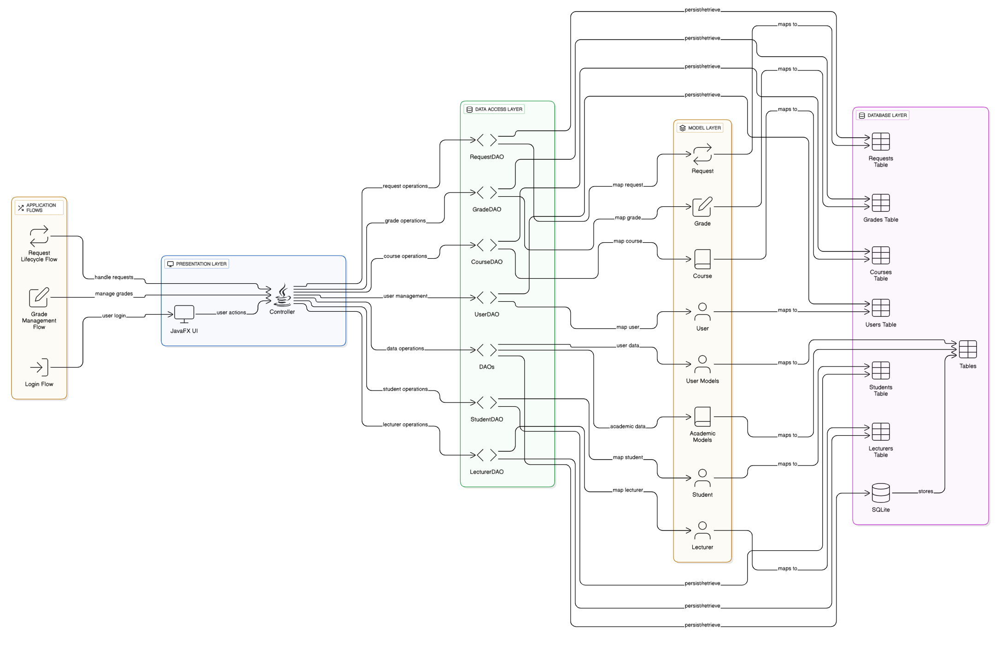
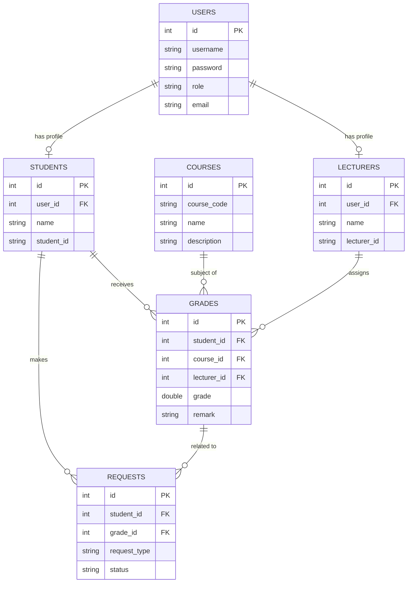

# System Architecture

## Overview
The Graded Application is a desktop-based grading system built using **Java** and **JavaFX** for the frontend, with **SQLite** as the local database. It follows a layered architecture separating the UI, Data Access, and Model layers.

## Architectural Pattern
The application uses a **DAO (Data Access Object)** pattern to separate business logic from data persistence.

## Class Structure

### Core Components
- **GradedApplication**: Main entry point and UI controller. Manages scene transitions and dashboard logic.
- **DatabaseHelper**: Manages database connection and table creation.

### Models
- **User**: Base entity for authentication (Roles: ADMIN, STUDENT, LECTURER).
- **Student**: Extends user info, links to `users` table.
- **Lecturer**: Extends user info, links to `users` table.
- **Course**: Represents a subject/course.
- **Grade**: Links Student, Course, and Lecturer with score data.
- **Request**: Represents student requests (e.g., remarking).

### DAOs
- **UserDAO**: Handles authentication and user management.
- **StudentDAO / LecturerDAO**: Manage specific profile data.
- **CourseDAO**: Manages course catalog.
- **GradeDAO**: Handles grade recording and retrieval.
- **RequestDAO**: Manages workflow for grade disputes/requests.

## Database Schema

## Application Flows

